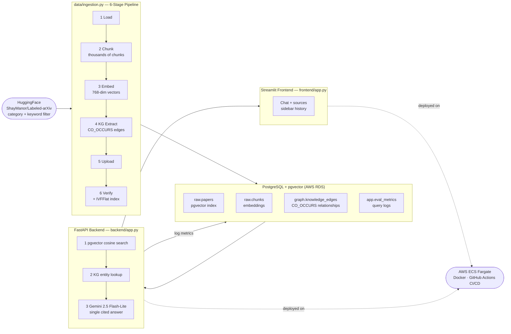

# Climate Research Intelligence System

> A cloud-native RAG system that answers natural language questions about
> climate and environmental science papers using pgvector similarity search,
> knowledge graph traversal, and Gemini 2.5 Flash-Lite — deployed on AWS.

---

## Live Demo

| Endpoint | URL |
|---|---|
| Frontend URL | [http://climate-rag-alb-1301514485.us-west-2.elb.amazonaws.com](http://climate-rag-alb-1301514485.us-west-2.elb.amazonaws.com) |
| Backend URL | [http://climate-rag-alb-1301514485.us-west-2.elb.amazonaws.com:3001](http://climate-rag-alb-1301514485.us-west-2.elb.amazonaws.com:3001) |

---

## What It Does

You ask a natural language question — for example *"What does the Last
Interglacial tell us about future sea level rise?"* (dozens more grouped
prompts in [`sample_questions.txt`](sample_questions.txt)). The system searches
your ingested climate corpus (see table below; size depends on `NUM_PAPERS`
and filters) using vector similarity and knowledge graph traversal, then
synthesizes a cited answer using Gemini 2.5 Flash-Lite. Every query is logged
to Postgres (`app.eval_metrics`); the API exposes `/metrics` and
`/metrics/history` for analytics or external dashboards.

---

## System Architecture



---

## Quickstart

> **For full step-by-step instructions see [RUN.md](RUN.md)**

### Option A — Single command (recommended)

```bash
bash reproduce.sh
```

Validates Python 3.12+, creates venv, installs dependencies (CPU PyTorch
first), checks Postgres with `scripts/db_connect.py`, starts the FastAPI
backend, runs smoke tests against that API, and launches the Streamlit
frontend.

### Option B — Manual

```bash
# 1. Clone and set up
git clone git@github.com:CloudComputing-CS5525/climate-rag.git
cd climate-rag
python3.12 -m venv venv
source venv/bin/activate
pip install --upgrade pip
pip install torch --index-url https://download.pytorch.org/whl/cpu
pip install -r requirements.txt

# 2. Configure environment
cp .env.example .env
# Fill in your credentials

# 3. Run ingestion (one-time; duration depends on filters and HF rate limits)
python3 data/ingestion.py --n 3000

# 4. Start backend
uvicorn backend.app:app --reload --port 3001

# 5. Start frontend
streamlit run frontend/app.py --server.port 3000
```

---

## Environment Variables

```bash
# Database
DB_HOST=localhost
DB_PORT=5432
DB_NAME=your_database
DB_USER=your_user
DB_PASSWORD=your_password

# LLM
GEMINI_API_KEY=your_gemini_key   # https://aistudio.google.com/app/apikey

# Deployment (Streamlit calls the API here — use your ALB backend URL in AWS)
BACKEND_URL=http://localhost:3001

# Optional — HuggingFace token for streaming arXiv dataset during ingestion
# HF_TOKEN=your_hf_token
```

---

## Dataset

**Source:** [`ShayManor/Labeled-arXiv`](https://huggingface.co/datasets/ShayManor/Labeled-arXiv) (`papers` subset) on HuggingFace  
**Domain:** arXiv categories (`CLIMATE_ARXIV_CATEGORY_MARKERS`) plus abstract keywords (`CLIMATE_KEYWORDS_REQUIRED`, word-boundary match)  
**Filter:** Non-deleted rows, category allow-list, quality gates, then ≥1 keyword in abstract  
**Size:** Up to 3,000 papers streamed — title + abstract only (no full PDF)  
**Preprocessing:** LaTeX removed, URLs stripped, whitespace normalized

**Corpus statistics** (one verified local ingest; re-run `GET /health/db` or Postgres after your own pipeline — counts change with `NUM_PAPERS`, category list, keywords, and whether ingest finished):

| Table | Rows | Description |
|---|---|---|
| raw.papers | 1,092 | Climate/environment arXiv papers (filtered) |
| raw.chunks | 2,765 | Text segments (200 words, 30-word overlap) |
| graph.knowledge_nodes | 18,791 | Scientific entities (scispaCy NER) |
| graph.knowledge_edges | 1,057,246 | CO_OCCURS relationships (weight ≥ 2) |
| graph.chunk_entity_map | 136,465 | Chunk-to-entity links |
| app.eval_metrics | 6 | Logged RAG queries |

---

## Project Structure

```
climate-rag/
├── backend/
│   ├── app.py              # FastAPI — all API endpoints + query logic
│   ├── retrieval.py        # pgvector search + knowledge graph retrieval
│   ├── logger.py           # Structured logging with request tracing
│   ├── Dockerfile
│   └── requirements.txt
├── frontend/
│   ├── app.py              # Streamlit — chat UI, citations, sidebar history
│   ├── Dockerfile
│   └── requirements.txt
├── data/
│   ├── ingestion.py        # 6-stage ingestion pipeline
│   └── config.py           # Centralized configuration
├── scripts/
│   └── db_connect.py       # Postgres connection helper
├── evaluation/
│   └── evaluate.py         # Metrics logging to app.eval_metrics
├── sql/
│   ├── 01_create_schema.sql  # Full schema (raw, graph, app + pgvector)
│   └── 02_create_index.sql   # pgvector IVFFlat index (optional speedup)
├── tests/
│   └── smoke_test.py       # Pytest smoke tests (needs running backend)
├── .github/
│   └── workflows/
│       ├── deploy-backend.yml   # CI/CD → AWS ECS
│       └── deploy-frontend.yml
├── artifacts/              # Run summaries and frozen requirements
├── reproduce.sh            # Single-command local runner
├── RUN.md                  # Full setup guide
├── requirements.txt
├── .env.example
└── .python-version         # 3.12
```

---

## API Reference

| Endpoint | Method | Description |
|---|---|---|
| `/health` | GET | Backend liveness check |
| `/health/db` | GET | Postgres connectivity + table row counts |
| `/query` | POST | Run RAG query — returns answer + citations |
| `/history` | GET | Retrieve chat history |
| `/metrics` | GET | Aggregated performance stats |
| `/metrics/history` | GET | Per-query metrics (for charts / analytics) |
| `/papers` | GET | List all papers in corpus |

---

## Reproducibility

- **Single command:** `bash reproduce.sh` validates environment, installs deps, starts services, runs smoke tests
- **Checkpointing:** Ingestion saves Parquet checkpoints after each stage — use `--resume` to skip completed stages
- **Determinism:** Random seeds fixed (`random.seed(100)`, `np.random.seed(100)`)
- **Pinned deps:** `artifacts/requirements_frozen.txt` contains pinned packages from a working environment
- **Smoke tests:** `pytest tests/smoke_test.py` hits a **running** backend (`BACKEND_URL`); it does not run SQL or ingestion

---

## Tech Stack

| Layer | Technology |
|---|---|
| Database | PostgreSQL 17 + pgvector (AWS RDS) |
| Embeddings | sentence-transformers/all-mpnet-base-v2 (768-dim) |
| NLP / KG | scispaCy en_core_sci_sm |
| LLM | Gemini 2.5 Flash-Lite (Google GenAI) |
| Backend | FastAPI + uvicorn |
| Frontend | Streamlit |
| Deployment | AWS ECS Fargate (Docker) |
| CI/CD | GitHub Actions |